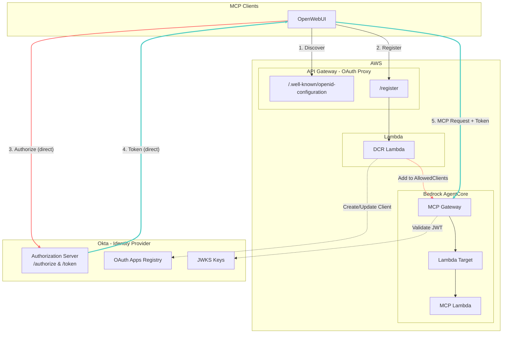

# MCP Gateway with Okta OAuth 2.1 DCR

This project deploys an AWS Bedrock AgentCore MCP Gateway with Dynamic Client Registration (DCR) using Okta as the OAuth 2.1 identity provider.

## Architecture Overview



> **Note**: OAuth authorization and token exchange (steps 3-4) go **directly to Okta**, not through API Gateway. Only discovery and client registration are proxied through AWS.

## Components

| Component | Description |
|-----------|-------------|
| **API Gateway** | Hosts OIDC discovery endpoint and DCR endpoint |
| **DCR Lambda** | Creates/updates OAuth clients in Okta and manages gateway AllowedClients |
| **MCP Gateway** | Bedrock AgentCore gateway that validates JWTs and routes MCP requests |
| **MCP Lambda** | Backend Lambda that handles actual MCP tool requests |

## OAuth 2.1 Flow

1. **Discovery**: Client fetches `/.well-known/openid-configuration`
2. **Registration**: Client calls `/register` to create OAuth credentials
3. **Authorization**: User authorizes via Okta
4. **Token Exchange**: Client exchanges auth code for access token
5. **MCP Access**: Client uses token to access MCP Gateway

## Prerequisites

- AWS Account with Bedrock AgentCore access
- Okta tenant with:
  - Authorization Server (default)
  - Service App with `okta.clients.manage` scope
  - Custom scope `agentcore.gateway.access` (optional)

## Deployment

### 1. Create Secret in AWS Secrets Manager

Store the Okta private key in Secrets Manager:

```bash
aws secretsmanager create-secret \
  --name "mcp-gateway/okta-private-key" \
  --secret-string "$(cat your-private-key.pem)"
```

Note the ARN returned (e.g., `arn:aws:secretsmanager:us-east-1:123456789012:secret:mcp-gateway/okta-private-key-AbCdEf`).

### 2. Configure Variables

Create `terraform.tfvars`:

```hcl
app_name                     = "mcp-gateway"
okta_domain                  = "your-tenant.okta.com"
okta_client_id               = "0oa..."  # Service App Client ID
okta_private_key_id          = "key-id-uuid"  # kid from Okta

# AWS Secrets Manager references
okta_private_key_secret_name = "mcp-gateway/okta-private-key"
okta_private_key_secret_arn  = "arn:aws:secretsmanager:us-east-1:123456789012:secret:mcp-gateway/okta-private-key-AbCdEf"
```

### 3. Deploy

```bash
cd terraform
terraform init
terraform apply -var="app_name=mcp-gateway"
```

### 3. Outputs

After deployment, you'll get:

| Output | Description |
|--------|-------------|
| `gateway_url` | MCP Gateway URL for clients |
| `oidc_config_url` | OIDC discovery endpoint |
| `dcr_endpoint` | Dynamic Client Registration endpoint |

## Configuration for MCP Clients

### OpenWebUI

Add MCP server with:
- **URL**: `{gateway_url}` from outputs
- **Auth Type**: OAuth 2.1
- **Discovery URL**: `{oidc_config_url}` from outputs

### Claude Code / MCP Inspector

```json
{
  "mcpServers": {
    "agentcore-gateway": {
      "type": "streamable-http",
      "url": "{gateway_url}",
      "auth": {
        "type": "oauth2.1",
        "discoveryUrl": "{oidc_config_url}"
      }
    }
  }
}
```

## Project Structure

```
.
├── lambda/
│   ├── dcr/
│   │   ├── index.py          # DCR Lambda handler
│   │   └── requirements.txt  # Python dependencies (PyJWT)
│   └── mcp/
│       └── handler.py        # MCP Lambda handler
└── terraform/
    ├── main.tf               # Provider configuration
    ├── variables.tf          # Input variables
    ├── outputs.tf            # Output values
    ├── gateway.tf            # AgentCore Gateway & MCP Lambda
    ├── dcr.tf                # API Gateway & DCR Lambda
    ├── layers.tf             # Lambda layers (PyJWT)
    └── oidc_cors.tf          # CORS configuration
```

## Security Considerations

- **Private Key Auth**: Service app uses private key JWT instead of client secret
- **Confidential Clients**: DCR creates confidential clients with `client_secret_post`
- **AllowedClients**: Gateway only accepts tokens from registered clients
- **Redirect URI Validation**: Optional domain pattern restriction for DCR

## Troubleshooting

### DCR Lambda Logs
```bash
aws logs tail /aws/lambda/{app_name}-dcr --since 30m
```

### Common Issues

| Issue | Cause | Solution |
|-------|-------|----------|
| 400 on authorize | Redirect URI mismatch | Re-register client or delete old client in Okta |
| Token validation failed | Client not in AllowedClients | Check DCR logs, verify client was added |
| client_secret mismatch | Auth method mismatch | Ensure `token_endpoint_auth_method` is `client_secret_post` |

## License

MIT
